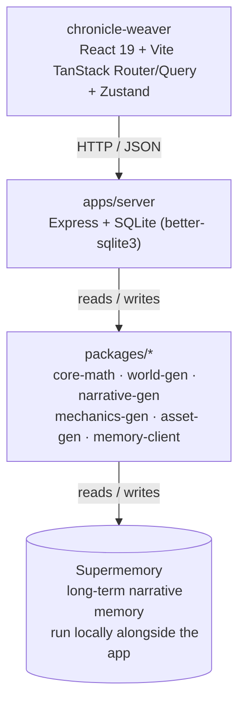

# The Wayfarer's Codex

*A chronicle unwritten — a procedurally-woven D&D-style narrative that reshapes itself around who you become.*

The Wayfarer's Codex is a text-driven adventure engine with no fixed story tree. Every choice you make nudges a continuous **decision vector** (morality, aggression, curiosity, risk tolerance, social affinity, faction allegiance). That vector — not a hand-authored branch — is the single source of truth that every generator (narrative, world, mechanics, palette) reads from, so the tale, the map, and even the UI's color palette drift to match the character you've actually been playing, rather than a character you selected from a menu.

---

## Table of contents

- [Architecture](#architecture)
- [Monorepo layout](#monorepo-layout)
- [The math model](#the-math-model)
- [Getting started](#getting-started)
- [Running Supermemory locally](#running-supermemory-locally)
- [Environment variables](#environment-variables)
- [Available scripts](#available-scripts)
- [API surface](#api-surface)
- [Conventions](#conventions)
- [Contributing](#contributing)

---

## Architecture



- **Frontend** (`chronicle-weaver/`) is a client-only single-page app built with TanStack Start's router, TanStack Query for data fetching, and Zustand for local game state. It renders three views: **The Tale** (decision-by-decision narrative), **The Map** (procedurally generated world chunks), and **Thyself** (the character sheet / decision-vector readout).
- **Backend** (`apps/server/`) is a small Express API that owns the session state, persists it to SQLite, and orchestrates the generator packages on every request.
- **Generators** (`packages/*`) are pure, independently testable TypeScript libraries — no framework code lives in them. The server is just a thin HTTP shell around them.
- **Memory** (`packages/memory-client` + `infra/supermemory`) integrates with a Supermemory instance so playthroughs can recall earlier narrative beats beyond what fits in the decision vector. This service is part of the standard local setup — see [Running Supermemory locally](#running-supermemory-locally) below.

> If your Markdown viewer doesn't render Mermaid diagrams (e.g. a plain-text editor), the shape is simply: **chronicle-weaver → (HTTP/JSON) → apps/server → (reads/writes) → packages/\* → (reads/writes) → Supermemory**.

---

## Monorepo layout

```
math-game/
├── apps/
│   └── server/            Express API — sessions, persistence, generation orchestration
├── chronicle-weaver/       React/Vite frontend (TanStack Start + Router + Query, Zustand, Tailwind v4)
├── packages/
│   ├── core-math/          Decision-vector math: smoothing, seeding, hashing, terrain mapping
│   ├── world-gen/          Procedural terrain, dungeons, wave-function-collapse map generation
│   ├── narrative-gen/      LLM-backed narrative + choice generation, prompt templates, plot skeletons
│   ├── mechanics-gen/      Loot tables, difficulty/balance curves derived from the decision vector
│   ├── asset-gen/          Procedural sprite/palette/L-system asset generation
│   └── memory-client/      Typed client for the Supermemory service
├── docs/                   Design docs (math model, conventions)
├── infra/supermemory/      Supermemory service notes/config
├── pnpm-workspace.yaml
└── package.json
```

This is a **pnpm workspace**: every folder under `apps/*` and `packages/*`, plus `chronicle-weaver`, is an independent package that can import its siblings via `workspace:*` (e.g. `apps/server` depends on `@math-game/core-math`, `@math-game/world-gen`, etc.). Run installs and builds from the repo root so the workspace links resolve correctly.

---

## The math model

Full derivation lives in [`docs/math-model.md`](./docs/math-model.md); the short version:

**Decision vector** — the state every generator reads from:

```ts
interface DecisionVector {
  morality: number;        // -1 (cruel) .. 1 (kind)
  aggression: number;      // 0 (avoidant) .. 1 (violent)
  curiosity: number;       // 0 .. 1
  riskTolerance: number;   // 0 .. 1
  socialAffinity: number;  // -1 (loner) .. 1 (collector of allies)
  allegiance: Record<string, number>; // factionId -> -1..1
  volatility: number;      // 0 .. 1, derived
}
```

**Update rule** — exponential smoothing, so no single decision defines the character:

```
D_t = α · impact_t + (1 − α) · D_(t-1)      (α = 0.20)
```

**Volatility** — tracks how erratic recent choices have been, decaying if the player settles into a consistent pattern:

```
volatility_t = β · |impact_t − D_(t-1)| + (1 − β) · volatility_(t-1)      (β = 0.30)
```

The vector also drives a deterministic seed, which world-gen and asset-gen use so the *same* character history always regenerates the *same* map and palette — the world is procedurally generated but not random from the player's point of view.

---

## Getting started

**Prerequisites:** Node.js 18+, [pnpm](https://pnpm.io) 9.x (root workspace), and a package manager matching whatever `chronicle-weaver/bunfig.toml` expects if you're working in that app specifically.

```bash
# 1. Clone and install
git clone https://github.com/dishitaghuge01/math-game.git
cd math-game
pnpm install

# 2. Configure environment variables (see below)
cp .env.example .env
cp apps/server/.env.example apps/server/.env

# 3. Start Supermemory locally (its own terminal — see below for details)
npx supermemory local

# 4. Start the backend (http://localhost:4000)
cd apps/server
pnpm dev

# 5. In a fourth terminal, start the frontend (http://localhost:8080)
cd chronicle-weaver
pnpm dev   # or `bun dev` if using bun in this app
```

Open **http://localhost:8080** and you'll be redirected to `/decision` to start a new chronicle. Three processes need to be running at once: Supermemory, `apps/server`, and `chronicle-weaver`.

---

## Playing the Expedition Phaser prototype

Start the server and frontend as described in [Getting started](#getting-started), then open the frontend and visit **`/world`**.

| Control | Action |
| --- | --- |
| Arrow keys | Move the Expedition Party / dodge projectiles |
| `E` | Travel to a nearby connected landmark |
| `1`–`5` | Combat actions: Strike, Guard, Signature, Item, Retreat |
| `1` / `2`, or `↑` / `↓` then `Enter` | Choose Discovery/Social options |
| `Space` | Reveal dialogue text immediately |
| `M` | Toggle synthesized audio |
| `R` | Toggle reduced-motion mode |

The one-Region loop includes Discovery, Social, Combat, Camp recovery, a final Encounter, and an ending. Use the Region page’s Expedition Code controls to export/import a deterministic run. For structured balance testing, follow [`docs/one-region-playtest.md`](./docs/one-region-playtest.md).

## Running Supermemory locally

This project runs Supermemory as a standard part of local development, so narrative generation has long-term recall beyond what fits in the decision vector. Start it in its own terminal before (or alongside) `apps/server`:

```bash
npx supermemory local
```

This starts a local Supermemory instance on its default port, **`http://localhost:6767`**. Leave it running for the whole dev session (three terminals total: Supermemory, `apps/server`, `chronicle-weaver`).

Then point the server at it in `apps/server/.env`:

```bash
SUPERMEMORY_API_KEY=<your local Supermemory key, if your local instance enforces one>
SUPERMEMORY_BASE_URL=http://localhost:6767
```

Restart `apps/server` after editing `.env` so it picks up the new values.

---

## Environment variables

| Variable | Where | Required | Purpose |
| --- | --- | --- | --- |
| `GROQ_API_KEY` | `apps/server/.env` | Yes | Powers narrative/choice generation in `packages/narrative-gen` |
| `SUPERMEMORY_API_KEY` | `apps/server/.env` | Yes | Authenticates against the local (or hosted) Supermemory instance |
| `SUPERMEMORY_BASE_URL` | `apps/server/.env` | Yes | Points at your running Supermemory instance — `http://localhost:6767` for local dev |
| `CORS_ORIGIN` | `apps/server/.env` | No | Restricts allowed origins in production; any `http://localhost:*` origin is allowed automatically outside `NODE_ENV=production` |
| `VITE_SERVER_URL` | `chronicle-weaver/.env` | No | Overrides the API base URL the frontend calls; defaults to `http://localhost:4000` |

---

## Available scripts

**Root** (`math-game/package.json`):

| Command | Description |
| --- | --- |
| `pnpm build` | Builds every workspace package (`pnpm -r build`) |

**`apps/server`:**

| Command | Description |
| --- | --- |
| `pnpm dev` | Runs the API with hot reload via `tsx` |
| `pnpm build` | Type-checks and compiles to `dist/` |
| `pnpm start` | Runs the compiled server (`node dist/index.js`) |

**`chronicle-weaver`:**

| Command | Description |
| --- | --- |
| `dev` | Starts the Vite dev server on port 8080 |
| `build` | Production build |
| `build:dev` | Development-mode build (useful for debugging a built bundle) |
| `preview` | Serves the production build locally |
| `lint` | ESLint over the whole app |
| `format` | Prettier write |

**Each package under `packages/*`** exposes its own `test` script (Vitest) — run `pnpm -r test` from the root to run the full suite, or `pnpm --filter @math-game/world-gen test` to target one package.

---

## API surface

The frontend talks to `apps/server` over plain JSON HTTP:

| Method | Path | Purpose |
| --- | --- | --- |
| `POST` | `/decision` | Submit a chosen option for the current narrative node; returns the updated decision vector and the next node id |
| `GET` | `/narrative/:nodeId` | Fetch the narrative text + available choices for a node |
| `GET` | `/world/:chunkId` | Fetch a procedurally generated map chunk |
| `GET` | `/mechanics` | Fetch generated mechanics (loot/difficulty) for the current session |
| `GET` | `/palette` | Fetch the current UI color palette, derived from the decision vector |

---

## Conventions

See [`docs/conventions.md`](./docs/conventions.md) for the locked module-resolution rules shared across every package in `packages/*` (extensionless intra-package imports, ESM-only, no `dist/`-pointing exports, matching `vitest.config.ts` per package, etc.). Please read it before adding a new package or touching build config — the rules exist because prior mismatches broke workspace resolution.

---

## Contributing

1. Fork and branch from `main`.
2. Keep changes to one package/app scoped per PR where possible — the conventions doc explains why cross-package incidental edits are flagged.
3. Run `pnpm -r test` and `pnpm --filter chronicle-weaver lint` before opening a PR.
4. Describe both *what* changed and *why* in the PR description — especially for anything touching the decision-vector math, since it's the shared contract every generator depends on.

---

